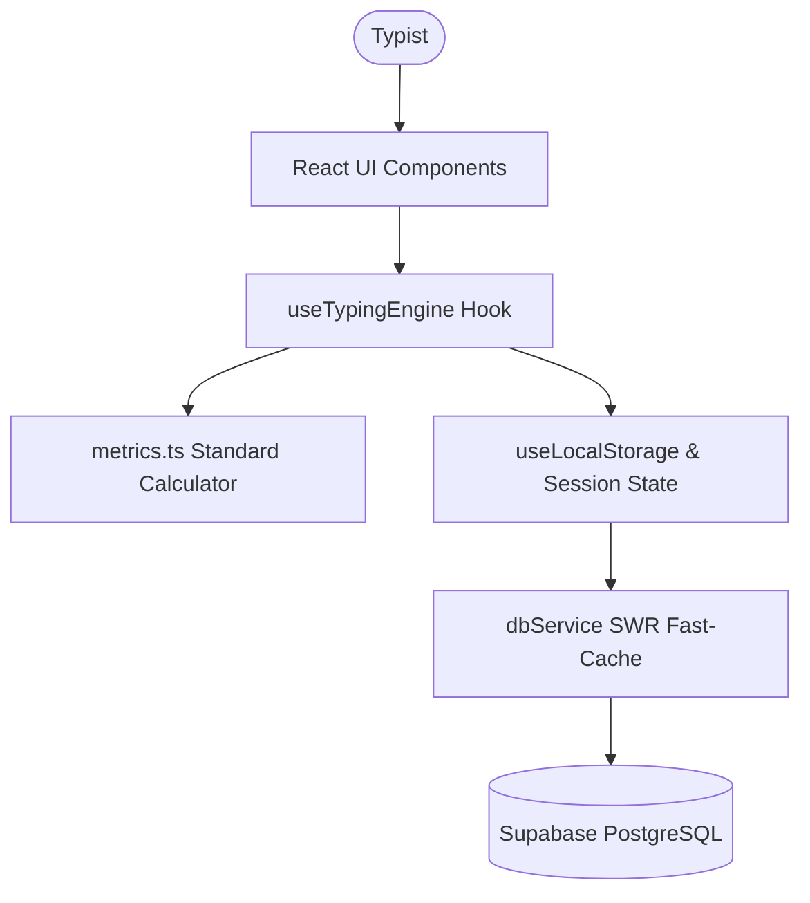

# 🏗️ TypeFlow Architecture Overview

TypeFlow is built with React 19, TypeScript, Vite, TailwindCSS, and Supabase.

## Core Modules

1. **Typing Engine (`src/hooks/useTypingEngine.ts`)**:
   * Reactive character-level keystroke tracking.
   * High-frequency performance timers utilizing `performance.now()`.
   * Standard space delimiter and missed-character accounting.

2. **Metrics Engine (`src/utils/metrics.ts`)**:
   * International standard: 5 keystrokes = 1 word.
   * Net WPM error penalties, burst speed detection, and stamina pacing ratios.

3. **Data Layer (`src/services/dbService.ts`)**:
   * Dual-mode persistence: in-memory / local storage SWR cache (0ms latency).
   * Asynchronous cloud sync to Supabase `test_results` and `profiles`.
